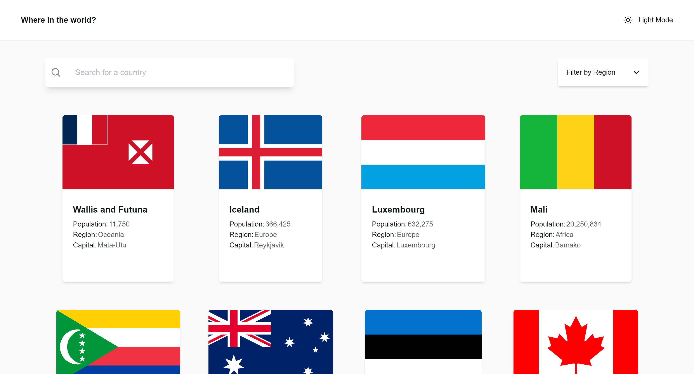
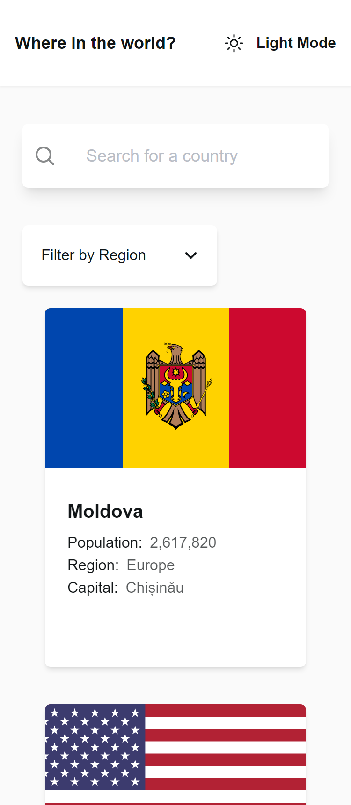

# Frontend Mentor - REST Countries API with color theme switcher solution

This is a solution to the [REST Countries API with color theme switcher challenge on Frontend Mentor](https://www.frontendmentor.io/challenges/rest-countries-api-with-color-theme-switcher-5cacc469fec04111f7b848ca). Frontend Mentor challenges help you improve your coding skills by building realistic projects. 

## Table of contents

- [Frontend Mentor - REST Countries API with color theme switcher solution](#frontend-mentor---rest-countries-api-with-color-theme-switcher-solution)
  - [Table of contents](#table-of-contents)
    - [The challenge](#the-challenge)
    - [Screenshot](#screenshot)
    - [Links](#links)
    - [Built with](#built-with)
    - [What I learned](#what-i-learned)
    - [Continued development](#continued-development)
    - [Useful resources](#useful-resources)
  - [Acknowledgments](#acknowledgments)


### The challenge

Users should be able to:

- See all countries from the API on the homepage
- Search for a country using an `input` field
- Filter countries by region
- Click on a country to see more detailed information on a separate page
- Click through to the border countries on the detail page
- Toggle the color scheme between light and dark mode *(optional)*

### Screenshot




### Links

- Solution URL: [solution URL](https://your-solution-url.com)
- Live Site URL: [Live URL](https://rest-countries-api-iota-eight.vercel.app/)
  

### Built with

- Semantic HTML5 markup
- CSS custom properties
- Flexbox
- CSS Grid
- Mobile-first workflow
- [React](https://reactjs.org/) - JS library
- [Tailwind CSS](https://tailwindcss.com/) CSS FrameWork
- [Radix UI](https://www.radix-ui.com/) Radix UI Components


### What I learned
I learned working with API and React-router for navigating through pages and utilized the `useParam` and `useSearchParam` to be able to pass data to another page and store values in browser URL, worked with search input and filtering lists and learned a lot.

```html
            <button
                className="flex items-center font-semibold ml-2"
                aria-pressed="false"  
            > <!--Learned the accessibility of aria-pressed used for buttons that are expected to have a toggle action -->

      </button>
```

```js
    .filter(countryName => countryName.name.toLowerCase().includes(searchCountry && searchCountry.toLowerCase()) || !searchCountry)
    .filter(countryRegion => countryRegion.region.toLowerCase().includes(filterRegion && filterRegion.toLowerCase()) || !filterRegion)
    // Utilized the filter array method to filter out countries by name and filtering regions as well
   
```


### Continued development
I want to practice using API and transfer data through multiple pages using react-router and improve on working with object arrays and it's methods like `.map` and `.filter`.


### Useful resources

- [Object function](https://developer.mozilla.org/en-US/docs/Web/JavaScript/Reference/Global_Objects/Object/entries) - Read on Object function and it's methods, good to reference docs often and understanding concepts
- [Filter method](https://developer.mozilla.org/en-US/docs/Web/JavaScript/Reference/Global_Objects/Array/filter) - Filter is a very useful array method and MDN docs is great to have an understanding of how things work.


## Acknowledgments
Frontend Mentor discord community is great at helping others and it's very beneficial for asking questions and get feedback from professionals.
